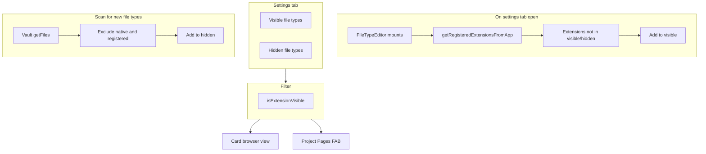

# File Type Visibility

Reference for how file type visibility controls what appears in the project browser view and the project pages menu.

## Why it exists

By default, the project browser shows all file types that Obsidian natively supports (notes, canvas files, PDFs, images, audio, video, etc.). File type visibility lets you hide file types you do not want to see in the browser or the pages menu—for example, plugin-generated JSON files, config files, or other auxiliary formats.

## Conceptual understanding

- **Visible file types** — Extensions in this list are shown in the project browser view and the project pages FAB menu.
- **Hidden file types** — Extensions in this list are suppressed. They do not appear in the project browser view or the project pages menu.
- **Unsupported file types** — A display category for extensions in hidden that are not in Obsidian's view registry (vault-scanned types). They are stored in hidden and derived at render time.

The same filter applies consistently across both surfaces: only files whose extension is in the visible list are shown.

## Three sections and color coding

The File Type Editor groups extensions into three categories, each with a distinct color:

| Section             | Source                                         | Color     | Description                                               |
| ------------------- | ---------------------------------------------- | --------- | --------------------------------------------------------- |
| Obsidian default    | Registry-derived (view metadata, no pluginId)  | Primary   | Built-in types (md, canvas, base, pdf, png, etc.)         |
| Obsidian registered | Registry-derived (view metadata has pluginId)  | Tertiary  | Plugin-registered (excalidraw, kanban, etc.)              |
| Unsupported         | Derived from `hidden` (extensions not in registry) | Secondary | From vault scan; types Obsidian does not natively support |

A legend above the file type sections shows sample chips in each color. The **Hidden** section displays all hidden types (including vault-scanned types), with distinct colors for registry-known vs unsupported. New vault extensions are auto-added to hidden on mount.

## Flows and relationships

## Using file type visibility

### Default visible file types

By default, visible file types include Obsidian's native formats:

- **Note** (`.md`)
- **Canvas** (`.canvas`)
- **Base** (`.base`)
- **PDF** (`.pdf`)
- Image formats (`.png`, `.jpg`, `.gif`, `.svg`, etc.)
- Audio formats (`.mp3`, `.ogg`, `.wav`, etc.)
- Video formats (`.mp4`, `.mov`, `.webm`, etc.)

### Auto-detect on settings open

When you open the File Type settings tab, the editor automatically discovers Obsidian-registered extensions (from `viewRegistry.typeByExtension`) and adds any that are not already in Visible or Hidden to the **Visible** list. It also scans the vault and adds any new extensions not in Visible or Hidden to the **Hidden** list. This ensures newly enabled plugins' file types appear without manual action.

### Drag-and-drop

You can drag file types between **Visible** and **Hidden** to change what appears in the browser and pages menu. The Hidden section displays all hidden types, with distinct colors for native/plugin vs vault-scanned (unsupported).

### Scan for new file types

On mount, the editor scans the vault for unique extensions and adds any not already in Visible or Hidden to the **Hidden** list. Newly discovered types appear in the Hidden section with the unsupported (secondary) color. Drag them to Visible if you want to show them in the browser.

### Add plugin-registered types

On mount, the editor discovers Obsidian-registered extensions (from `viewRegistry.typeByExtension`) and adds any not already in Visible or Hidden to the **Visible** list. This ensures newly enabled plugins' file types appear without manual action.

### Display names

Only **Note** (`.md`), **Canvas** (`.canvas`), and **Base** (`.base`) use pretty display names. All other extensions are shown as `.ext` (e.g. `.pdf`, `.png`).

### Chip display (visible and hidden)

All file type chips show the display name (or `.ext`) on the first line. For plugin-registered types, the registering plugin name is shown on a second line (e.g. "via Excalidraw") when Obsidian's view registry exposes it. Hidden file types additionally show the extension when a pretty name exists (Note, Canvas, Base).

## Technical implementation

- **Settings**: `plugin.settings.fileTypes.visible`, `plugin.settings.fileTypes.hidden` (string arrays of extensions).
- **Filter**: `isExtensionVisible(extension)` in `src/logic/file-type-filter.ts` — returns `true` only when the extension is in the visible list.
- **Project browser**: `getSortedSectionsInFolder` and `getSortedSectionsInFolderAsync` in `src/logic/folder-processes.ts` skip files whose extension fails the filter.
- **Pages menu**: `ProjectPagesFAB` in `src/components/project-pages-fab/` filters its page list with the same function.
- **File type editor**: `FileTypeEditor` in `src/components/file-type-editor/` renders the visible and hidden sections with ReactSortable for drag-and-drop, plus a legend and color-coded chips.

## Technical gotchas

- Extensions are compared case-insensitively.
- `.pbs` (project settings) is in the default hidden list and never appears in the browser or pages menu.
- The scan excludes empty extensions and `.pbs`.
- Auto-detect runs when the settings tab mounts; plugins that register later may require reopening settings.
- `getRegisteredExtensionsFromApp` reads from Obsidian's internal view registry (`viewRegistry.typeByExtension`), which is undocumented. If the registry is inaccessible, it falls back to a minimal set (`md`, `canvas`, `base`). If Obsidian changes this structure in a future version, the registry-based logic may need adjustment.
- Native vs plugin (default vs registered) is derived at runtime: view metadata is checked for `pluginId`; if present, the extension is plugin-registered.
- Plugin attribution (e.g. "via Plugin Name") on chips probes `viewRegistry.views` or `byType`; this is best-effort and may not work in all Obsidian versions.
- ReactSortable uses a shared `group` so items can be dragged between Visible and Hidden.
