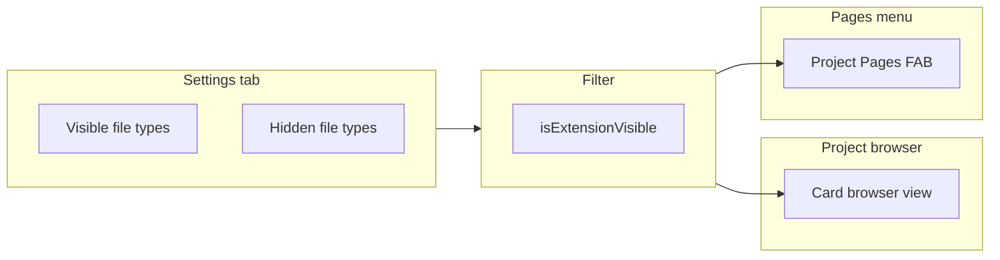

# File Type Visibility

Reference for how file type visibility controls what appears in the project browser view and the project pages menu.

## Why it exists

By default, the project browser shows all file types that Obsidian natively supports (notes, canvas files, PDFs, images, audio, video, etc.). File type visibility lets you hide file types you do not want to see in the browser or the pages menu—for example, plugin-generated JSON files, config files, or other auxiliary formats.

## Conceptual understanding

- **Visible file types** — Extensions in this list are shown in the project browser view and the project pages FAB menu.
- **Hidden file types** — Extensions in this list are suppressed. They do not appear in the project browser view or the project pages menu.

The same filter applies consistently across both surfaces. Only files whose extension is in the visible list are shown.

## Flows and relationships

## Using file type visibility

### Default visible file types

By default, visible file types include Obsidian’s native formats:

- **Note** (`.md`)
- **Canvas** (`.canvas`)
- **Base** (`.base`)
- **PDF** (`.pdf`)
- Image formats (`.png`, `.jpg`, `.gif`, `.svg`, etc.)
- Audio formats (`.mp3`, `.ogg`, `.wav`, etc.)
- Video formats (`.mp4`, `.mov`, `.webm`, etc.)

### Drag-and-drop

You can drag file types between **Visible** and **Hidden** to change what appears in the browser and pages menu. Dragging to the “Drag here to delete” dropzone removes a type from both lists; it will no longer appear until you add it back (for example, via scan).

### Scan for new file types

The **Scan for new file types** button in the Hidden section:

1. Scans all files in your vault for unique extensions.
2. Merges that with a known set of Obsidian-native extensions.
3. Adds any extensions not already in Visible or Hidden to the **Hidden** list.

Newly discovered types are added to Hidden by default so you can review and drag them to Visible if you want to show them.

## Technical implementation

- **Settings**: `plugin.settings.fileTypes.visible` and `plugin.settings.fileTypes.hidden` (string arrays of extensions).
- **Filter**: `isExtensionVisible(extension)` in `src/logic/file-type-filter.ts` — returns `true` only when the extension is in the visible list.
- **Project browser**: `getSortedSectionsInFolder` and `getSortedSectionsInFolderAsync` in `src/logic/folder-processes.ts` skip files whose extension fails the filter.
- **Pages menu**: `ProjectPagesFAB` in `src/components/project-pages-fab/` filters its page list with the same function.
- **File type editor**: `FileTypeEditor` in `src/components/file-type-editor/` renders the visible/hidden sections with ReactSortable for drag-and-drop.

## Technical gotchas

- Extensions are compared case-insensitively.
- `.pbs` (project settings) is in the default hidden list and never appears in the browser or pages menu.
- The scan excludes empty extensions and `.pbs`.
- Unknown types in the visible list are shown with their extension (e.g. `.json`) instead of a display name.
