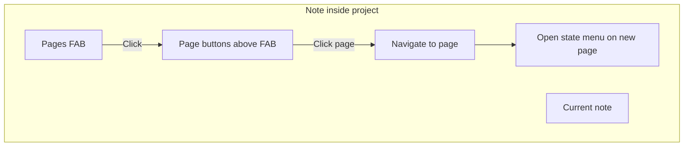

# Project Pages FAB

Reference for the Project Pages floating action button (FAB) shown when editing a note inside a project.

## Why it exists

When working in a project, you often need to jump between its pages. The Project Pages FAB provides quick navigation to other pages in the same project without leaving the note view. It appears in the same bottom-right position as the project browser FAB for consistency.

## Conceptual understanding

- **Project Pages FAB** — A floating button with a pages icon that appears when the open note is inside a project folder. Clicking it reveals the names of other pages in that project.
- **Pages** — The direct file children of the project folder (excluding `folder-settings.pbs`). Notes in subfolders of a project are not included.

## Flows and relationships

### When the FAB appears

1. You open a note (markdown file) in the editor.
2. The note’s parent folder is a project (has `folder-settings.pbs` with `isProject: true`).
3. The FAB appears in the bottom-right corner.

### Using the FAB

1. Click the FAB to open the pages menu.
2. Other project pages appear as floating buttons above the FAB, aligned to its right edge.
3. Click a page to navigate to it in the same leaf. The state menu on that page opens by default.
4. Click the FAB again or click anywhere else (note content or embeds) to close the menu.

### Visual feedback

- When the menu is open, the FAB is highlighted (accent color) so you know it can be clicked again to close.

## Technical implementation

- **Component**: `ProjectPagesFAB` in `src/components/project-pages-fab/`
- **Integration**: Rendered from `registerMarkdownViewMods` when the active file’s parent is a project (`getFolderSettings().isProject === true`).
- **Page list**: Derived from `getItemsInFolder(projectFolder)` — filtered to `TFile`, excludes `.pbs`, excludes current file, sorted by name.
- **Navigation**: Uses `openFileInSameLeaf` followed by `openStateMenuIfClosed`.
- **Click-outside close**: `pointerdown` on `document`; closes when the target is outside the FAB/buttons container.

## Technical gotchas

- **Empty or single-page projects** — The FAB still appears; the page list is simply empty when there are no other pages.
- **Notes in subfolders** — Only notes whose **direct parent** is the project folder see the FAB. Notes inside subfolders of a project do not.
- **Embed content** — Clicks inside transcluded or embedded content close the menu, since those elements are part of the document and the `pointerdown` target is outside the FAB.
